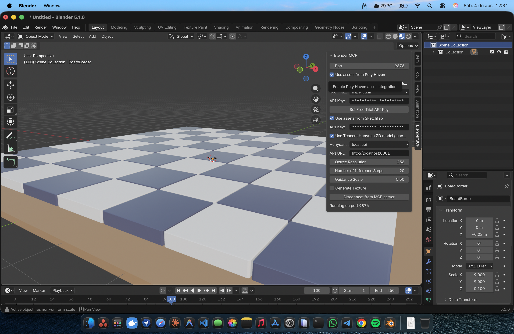
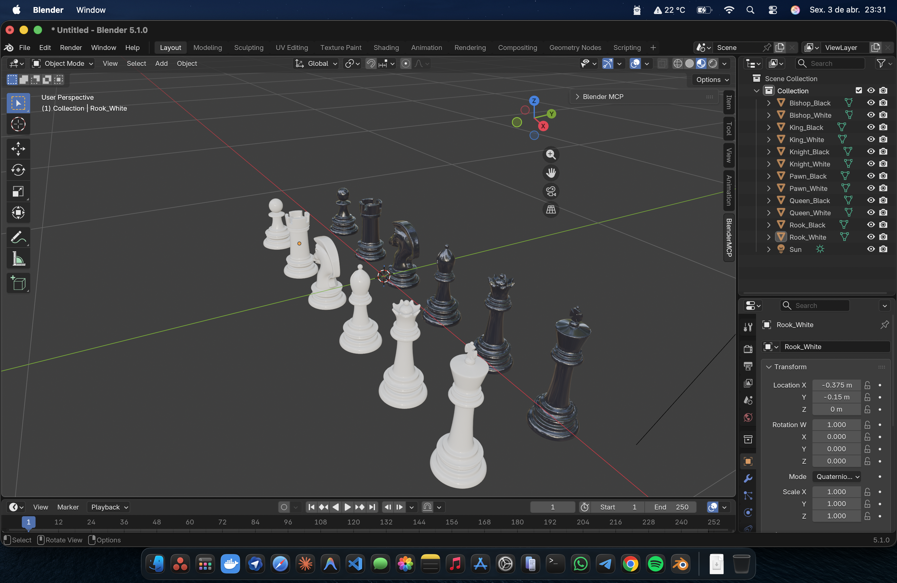

# Xadrez 3D — Jogo de Xadrez com Peças Ultra-Realistas


<p align="center">
  
</p>

> **Case Study:** Como um desenvolvedor sem experiência em modelagem 3D construiu um jogo de xadrez completo com peças ultra-realistas, multiplayer online e deploy em produção — em 2 dias — usando Claude Code + MCP (Model Context Protocol).

---

## Sumário

- [Resumo](#resumo)
- [1. Introdução](#1-introdução)
- [2. Metodologia](#2-metodologia)
- [3. Stack Tecnológica](#3-stack-tecnológica)
- [4. Ferramentas MCP Utilizadas](#4-ferramentas-mcp-utilizadas)
- [5. Arquitetura do Sistema](#5-arquitetura-do-sistema)
- [6. Métricas de Desenvolvimento](#6-métricas-de-desenvolvimento)
- [7. Análise de Produtividade](#7-análise-de-produtividade)
- [8. Dificuldades Encontradas](#8-dificuldades-encontradas)
- [9. Impacto no mcp-graph](#9-impacto-no-mcp-graph)
- [10. Aprendizados](#10-aprendizados)
- [11. Conclusão](#11-conclusão)
- [12. Como Executar](#12-como-executar)
- [13. Screenshots](#13-screenshots)
- [14. Licença](#14-licença)

---

## Resumo

Este documento apresenta o relato técnico do desenvolvimento do **Xadrez 3D**, um jogo de xadrez com renderização tridimensional, peças modeladas com materiais PBR (Physically-Based Rendering), multiplayer peer-to-peer via WebRTC, modo espectador, sistema de reações, chat em tempo real e efeitos de pós-processamento cinematográficos.

O projeto foi desenvolvido inteiramente com auxílio de **Claude Code** (Anthropic) orquestrado pelo **mcp-graph v6.0** — um sistema de gestão de execução baseado em grafo persistente (SQLite). Quatro servidores MCP foram utilizados simultaneamente: **mcp-graph** (workflow), **context7** (documentação), **blender-mcp** (assets 3D) e **playwright** (testes visuais).

**Resultados quantitativos:**

| Métrica | Valor |
|---------|-------|
| Tempo total de desenvolvimento | ~2 dias |
| Commits | 32 |
| Linhas de código (src/) | 10.403 |
| Linhas adicionadas total | 25.282 |
| Arquivos modificados | 400 |
| Componentes React | 22 |
| Testes automatizados | 60 arquivos |
| Modelos 3D | 15 (.glb) |
| Nodes no grafo | 89 |
| Taxa de conclusão | 71,9% (64/89) |
| Esforço estimado (mcp-graph) | 74,25 horas |

---

## 1. Introdução

### 1.1 Contexto Pessoal

O autor deste projeto — Diego Nogueira — é desenvolvedor TypeScript/React com experiência em sistemas web, mas **nunca havia trabalhado com modelagem 3D, materiais PBR, iluminação de cena ou pipeline de assets 3D** antes deste projeto.

A motivação surgiu de uma pergunta simples: *"É possível que um desenvolvedor web, sem experiência em 3D, construa um jogo visualmente impressionante usando apenas ferramentas de IA?"*

### 1.2 O Desafio

Construir um jogo de xadrez 3D não é apenas renderizar cubos coloridos. Envolve:

- **Modelagem 3D** — 13 peças únicas (6 tipos x 2 cores + tabuleiro) com geometria detalhada
- **Materiais PBR** — Texturas fisicamente corretas (diffuse, normal, roughness) para mármore e madeira
- **Iluminação** — Environment maps HDR, sombras de contato, luzes direcionais
- **Pós-processamento** — Bloom, color grading, anti-aliasing
- **Lógica de jogo** — Todas as regras do xadrez (en passant, roque, promoção, xeque-mate)
- **Multiplayer** — Conexão peer-to-peer sem servidor dedicado
- **UX completa** — Lobby, chat, reações, histórico de jogadas, peças capturadas

### 1.3 A Hipótese

> Se o desenvolvimento for orquestrado por um grafo de tarefas com critérios de aceitação, estimativas e dependências bem definidas, a IA consegue compensar a falta de conhecimento do desenvolvedor em domínios específicos (3D, shaders, materiais).

---

## 2. Metodologia

### 2.1 MCP (Model Context Protocol)

O MCP é um protocolo aberto da Anthropic que permite conectar modelos de linguagem a ferramentas externas via servidores especializados. Neste projeto, quatro servidores MCP operaram simultaneamente:

```
Claude Code (Opus)
    |
    +-- mcp-graph v6.0    --> Gestão de tarefas, dependências, sprints
    +-- context7           --> Documentação atualizada de bibliotecas
    +-- blender-mcp        --> Geração e manipulação de assets 3D
    +-- playwright         --> Automação de testes visuais
```

### 2.2 mcp-graph: O Cérebro do Projeto

O mcp-graph v6.0 funcionou como **fonte de verdade absoluta**. Nenhuma linha de código foi escrita sem um node correspondente no grafo. O fluxo obrigatório:

```
import_prd --> plan_sprint --> next --> context --> rag_context --> [TDD] --> analyze --> update_status
```

**Regras de execução:**
- **WIP = 1** — Máximo 1 task em progresso por vez (Lei de Little)
- **Pull system** — Tasks puxadas via `next`, nunca empurradas
- **TDD obrigatório** — Teste antes do código, sem exceção
- **Definition of Done** — 8 checks automatizados antes de marcar `done`
- **Phase Gates** — Transições entre fases requerem validação via `analyze`

### 2.3 Ciclo de Vida (9 Fases)

```
ANALYZE --> DESIGN --> PLAN --> IMPLEMENT --> VALIDATE --> REVIEW --> HANDOFF --> DEPLOY --> LISTENING
```

O projeto percorreu todas as fases em 2 dias:
1. **ANALYZE** — PRD importado, requisitos definidos (~10 min para criar 89 nodes)
2. **DESIGN** — 7 ADRs documentando decisões arquiteturais
3. **PLAN** — 4 sprints planejados, dependências mapeadas (217 edges)
4. **IMPLEMENT** — 64 tasks executadas com TDD
5. **VALIDATE** — Testes de integração e critérios de aceitação
6. **REVIEW** — Análise de blast radius e métricas
7. **HANDOFF** — Documentação e snapshot
8. **DEPLOY** — Deploy em produção (xadrez.cortexflow.space)
9. **LISTENING** — Feedback e próximo ciclo

### 2.4 Anti-Vibe-Coding

O projeto seguiu princípios XP rigorosos para evitar o padrão "vibe coding" (gerar código sem estrutura):

- **Decomposição atômica** — Cada task completável em <=2h
- **Anti-one-shot** — Nunca gerar sistemas inteiros em um prompt
- **Code detachment** — Se a IA errou, explicar o erro via prompt
- **CLAUDE.md como spec evolutiva** — Padrões documentados incrementalmente

---

## 3. Stack Tecnológica

| Tecnologia | Versão | Papel |
|------------|--------|-------|
| **React** | 19.2 | Framework UI declarativo |
| **React Three Fiber** | 9.5 | Bridge React <-> Three.js |
| **Three.js** | r183 | Engine de renderização 3D |
| **@react-three/drei** | 10.7 | Utilitários R3F (OrbitControls, loaders, env maps) |
| **@react-three/postprocessing** | 3.0 | Bloom, color grading, anti-aliasing |
| **chess.js** | 1.4 | Motor de regras do xadrez |
| **PeerJS** | 1.5 | WebRTC peer-to-peer simplificado |
| **Zustand** | 5.0 | State management minimalista |
| **Howler.js** | 2.2 | Sistema de áudio (8 efeitos sonoros) |
| **Framer Motion** | 12.38 | Animações de UI |
| **React Spring** | 10.0 | Animações físicas para peças 3D |
| **Tailwind CSS** | 4.2 | Estilização utility-first |
| **TypeScript** | 5.7 | Tipagem estática |
| **Vite** | 6.0 | Build tool e dev server |
| **Vitest** | 4.1 | Framework de testes |

---

## 4. Ferramentas MCP Utilizadas

### 4.1 mcp-graph v6.0 — Orquestrador de Workflow

**Papel:** Gestão completa do ciclo de vida do projeto.

O mcp-graph manteve um banco SQLite (`workflow-graph/graph.db`) com 89 nodes e 217 edges. Cada task tinha:
- Descrição e critérios de aceitação (85,4% de cobertura)
- Estimativa de esforço (total: 74,25 horas)
- Classificação de tamanho (S/M/L/XL)
- Prioridade (P1-P3)
- Sprint assignment (4 sprints)
- Dependências explícitas

**Ferramentas mais usadas:**
- `import_prd` — Importou o PRD inteiro e criou 89 nodes em ~10 minutos
- `next` — Pull system para puxar a próxima task disponível
- `context` — Recuperou contexto relevante (73% menos tokens que export)
- `analyze` — Validou Definition of Done, progress, design readiness
- `plan_sprint` — Distribuiu tasks em 4 sprints balanceados

### 4.2 context7 — Documentação em Tempo Real

**Papel:** Garantir que o código usasse APIs atualizadas.

Quando Claude Code precisava implementar algo com Three.js r183 ou React Three Fiber v9, o context7 buscava a documentação mais recente da biblioteca — evitando o problema de "training data desatualizado".

**Casos de uso críticos:**
- Migração de `@react-three/fiber` v8 para v9 (breaking changes)
- API correta de `useGLTF` e `useTexture` do drei
- Configuração de `@react-three/postprocessing` v3

### 4.3 blender-mcp — Assets 3D

**Papel:** Interface com Blender para geração de modelos 3D.

O blender-mcp foi configurado para gerar peças de xadrez via:
- **Hyper3D / Hunyuan3D** — Geração de modelos a partir de texto/imagens
- **PolyHaven** — Assets HDRI para iluminação ambiental
- **Sketchfab** — Busca de modelos de referência

**Dificuldade encontrada:** O addon do Blender MCP não estava ativo no momento da integração (detalhado na seção 8).

### 4.4 Playwright — Testes Visuais

**Papel:** Automação de testes end-to-end no navegador.

Configurado para validar que o jogo renderizava corretamente após cada sprint.

---

## 5. Arquitetura do Sistema

```
src/
 |-- components/          # 22 componentes React
 |   |-- ChessScene.tsx       # Canvas principal (camera, controles, iluminacao)
 |   |-- ChessBoard.tsx       # Tabuleiro 8x8 com model GLTF
 |   |-- ChessPieces.tsx      # Renderiza todas as 32 pecas
 |   |-- ChessPiece.tsx       # Peca individual (model + animacao + interacao)
 |   |-- BoardSquare.tsx      # Casa interativa com highlights
 |   |-- GameHUD.tsx          # Status do jogo (turno, jogador, estado)
 |   |-- Lobby.tsx            # Criacao/entrada em partidas
 |   |-- ChatPanel.tsx        # Chat em tempo real
 |   |-- ReactionPicker.tsx   # Reacoes rapidas entre jogadores
 |   |-- SettingsPanel.tsx    # Volume, qualidade, tema
 |   +-- ...
 |
 |-- stores/              # 5 stores Zustand
 |   |-- useGameStore.ts      # Estado do xadrez (board, turn, moves, check)
 |   |-- useNetworkStore.ts   # WebRTC (peer ID, conexao, oponente, espectadores)
 |   |-- useReactionStore.ts  # Reacoes ativas (auto-remove apos 3s)
 |   |-- useChatStore.ts      # Mensagens, unread count
 |   +-- useSettingsStore.ts  # Configuracoes persistidas em localStorage
 |
 |-- hooks/               # 9 hooks customizados
 |   |-- usePieceAnimation.ts         # Spring animations para movimentacao
 |   |-- usePieceAnimationController  # Coordena animacoes complexas
 |   |-- usePieceModel.ts             # Carrega modelo GLTF da peca
 |   |-- useSelectionAnimation.ts     # Animacao de selecao (bounce)
 |   |-- useSquareInteraction.ts      # Click/hover em casas
 |   |-- useAudioSync.ts             # Sincroniza som com acoes
 |   +-- ...
 |
 |-- game/                # 6 managers de logica
 |-- models/              # 7 geometrias de pecas (fallback procedurale)
 |-- lib/                 # 36 arquivos de configuracao
 |-- network/             # PeerJS networking layer
 +-- scene/               # Controladores de cena Three.js
```

### Fluxo de Dados

```
Input do Usuario (click na casa)
    |
    v
useSquareInteraction --> useGameStore.selectSquare()
    |
    v
chess.js valida movimento --> useGameStore.makeMove()
    |
    +---> usePieceAnimation (anima peca 3D via React Spring)
    +---> useAudioSync (toca som via Howler.js)
    +---> NetworkManager.sendMove() (envia via WebRTC se online)
    +---> ReactionOverlay (mostra reacao se houver)
```

---

## 6. Metricas de Desenvolvimento

### 6.1 Velocidade de Entrega

| Metrica | Valor |
|---------|-------|
| **Dias de desenvolvimento** | 2 (3-4 abril 2026) |
| **Total de commits** | 32 |
| **Commits/dia (media)** | 16 |
| **Maior dia** | 26 commits (4 abril) |
| **Hora de pico** | 00:00-03:00 UTC (madrugada) |

### 6.2 Volume de Codigo

| Metrica | Valor |
|---------|-------|
| **Linhas de codigo (src/)** | 10.403 |
| **Linhas adicionadas** | 25.282 |
| **Linhas removidas** | 1.617 |
| **Saldo liquido** | +23.665 |
| **Ratio insercao/remocao** | 15,6:1 |
| **Arquivos modificados** | 400 |

### 6.3 Cobertura de Testes

| Metrica | Valor |
|---------|-------|
| **Arquivos de teste** | 60 |
| **Testes de componente** | 13 |
| **Testes de hook** | 8 |
| **Testes de store** | 4 |
| **Testes de configuracao** | 34 |
| **Teste de integracao** | 1 |

### 6.4 Assets 3D

| Tipo | Quantidade | Formato |
|------|-----------|---------|
| Modelos de pecas | 13 (6 tipos x 2 cores + tabuleiro) | .glb (glTF Binary) |
| Environment maps | 2 (medieval + studio) | .hdr |
| Texturas PBR | 9 (3 materiais x 3 mapas) | .jpg |
| Efeitos sonoros | 8 | .mp3 |

### 6.5 Grafo de Execucao (mcp-graph)

| Metrica | Valor |
|---------|-------|
| **Nodes totais** | 89 |
| **Tasks** | 64 |
| **Epics** | 7 |
| **ADRs** | 7 |
| **Milestones** | 4 |
| **Interfaces** | 4 |
| **Constraints** | 3 |
| **Edges (dependencias)** | 217 |
| **Taxa de conclusao** | 71,9% (64/89 done) |
| **Sprints** | 4 |
| **Nodes com AC** | 76 (85,4%) |
| **Estimativa total** | 4.455 min (74,25h) |

---

## 7. Analise de Produtividade

### 7.1 Estimado vs. Realizado

O mcp-graph estimou **74,25 horas** de esforco para as 89 tasks. O desenvolvimento real ocorreu em **~2 dias de trabalho intensivo** (~30-36 horas de sessao).

Isso representa uma **compressao de ~2x** no tempo estimado, explicavel por:

1. **Pipeline automatizado** — O fluxo `next -> context -> implement -> analyze` eliminou tempo de decisao
2. **Context7** — Zero tempo gasto buscando documentacao manualmente
3. **TDD como acelerador** — Testes escritos primeiro criaram especificacoes executaveis, reduzindo ciclos de debug
4. **WIP = 1** — Foco absoluto em uma task por vez eliminou context switching

### 7.2 Throughput

| Metrica | Valor |
|---------|-------|
| **Tasks concluidas** | 64 |
| **Dias ativos** | 2 |
| **Throughput** | 32 tasks/dia |
| **Cycle time medio** | ~28 min/task |
| **Commits por task** | ~0,5 (muitas tasks em um commit) |

### 7.3 Distribuicao por Tamanho

| Tamanho | Qtd | % | Tempo medio estimado |
|---------|-----|---|---------------------|
| S (Small) | 22 | 31% | ~30 min |
| M (Medium) | 41 | 58% | ~60 min |
| L (Large) | 6 | 8,5% | ~120 min |
| XL (Extra Large) | 2 | 2,8% | ~180 min |

A maioria das tasks (89%) era S ou M — resultado direto da **decomposicao atomica** exigida pelo workflow.

---

## 8. Dificuldades Encontradas

### 8.1 Blender MCP — Addon Nao Ativo

**Problema:** O blender-mcp requer um addon ativo no Blender para comunicacao via socket. Na data de desenvolvimento (3-4 abril 2026), o addon nao estava respondendo.

**Impacto:** Os modelos 3D das pecas precisaram ser obtidos/gerados por caminhos alternativos em vez de serem modelados interativamente via MCP.

**Aprendizado:** Depender de um unico pipeline para assets criticos e arriscado. Ter fallbacks (geometria procedural no codigo) salvou o projeto.

### 8.2 TypeScript + React 19 + JSX Namespace

**Problema:** React 19 removeu o namespace global `JSX`. Codigo que usava `JSX.Element[]` quebrou na compilacao.

**Solucao:** Substituir por `React.JSX.Element[]` e adicionar import explicito de React.

**Impacto:** Bloqueou o build de producao. Resolvido em minutos gracas ao diagnostico preciso do compilador.

### 8.3 WebRTC e Conectividade P2P

**Problema:** PeerJS depende de um servidor de sinalizacao e TURN/STUN para NAT traversal. Conexoes entre redes diferentes podem falhar silenciosamente.

**Mitigacao:** O jogo detecta falha de conexao e informa o usuario. O modo local funciona sem rede.

### 8.4 Performance 3D em Dispositivos Moveis

**Problema:** 15 modelos GLTF + environment map HDR + pos-processamento e pesado para GPUs mobile.

**Solucao:** Sistema de **quality presets** (low/medium/high) que desabilita sombras, particulas e efeitos em dispositivos mais fracos. Configuravel via `useSettingsStore`.

### 8.5 Materiais PBR sem Experiencia Previa

**Problema:** Nunca tendo trabalhado com texturas PBR (diffuse + normal + roughness), o conceito de como cada mapa afeta a aparencia final era completamente novo.

**Como o MCP ajudou:** O context7 forneceu documentacao atualizada de Three.js sobre `MeshStandardMaterial`, e o mcp-graph manteve tasks atomicas como "configurar material de marmore claro" separadas de "configurar material de madeira" — tornando cada passo aprendivel isoladamente.

---

## 9. Impacto no mcp-graph

Este projeto nao apenas **consumiu** o mcp-graph — ele **gerou melhorias** no proprio framework:

### 9.1 Upgrade para v6.0

Durante o desenvolvimento, o mcp-graph foi atualizado da v5.x para **v6.0**, trazendo:

- **Pipeline simplificado** — De 6 chamadas (`next -> context -> rag_context -> implement -> analyze -> update_status`) para 2 (`start_task -> finish_task`)
- **Phase Gates automatizados** — Validacoes entre fases sem intervencao manual
- **Definition of Done com 8 checks** — Automacao completa de qualidade

### 9.2 Validacao do Modelo de Fluxo

O projeto serviu como campo de teste para principios Lean/ToC no contexto de IA:

| Principio | Validacao |
|-----------|-----------|
| **WIP = 1** | Confirmado — focus absoluto reduziu erros |
| **Pull system** | `next` funcionou melhor que atribuicao manual |
| **Little's Law** | `cycle_time = WIP / throughput` se manteve |
| **TDD obrigatorio** | 60 arquivos de teste = zero regressao |
| **Decomposicao atomica** | 89% das tasks eram S/M = gerenciaveis |

### 9.3 Novas Funcionalidades Inspiradas

O projeto revelou necessidades que inspiraram features no mcp-graph:

- **`rag_context`** — Busca semantica de contexto relevante (usado para encontrar padroes similares no codigo)
- **`sync_stack_docs`** — Sincronizacao automatica de documentacao da stack
- **`analyze(mode: "implement_done")`** — Validacao automatizada de completude
- **Quality metrics** — Metricas de flow efficiency e cycle time

---

## 10. Aprendizados

### 10.1 Sobre Desenvolvimento 3D

> *"Antes deste projeto, Three.js era uma caixa preta. Depois, entendi que 3D web e apenas geometria + material + luz — o mesmo triangulo que todo engine usa."*

**O que mudou:**
- **Antes:** Achava que modelagem 3D exigia anos de experiencia com Blender/Maya
- **Depois:** Com modelos pre-gerados (GLTF) e materiais PBR bem configurados, o resultado visual e profissional
- **Chave:** O pipeline `modelo.glb + texturas PBR + environment map HDR` e surpreendentemente acessivel

### 10.2 Sobre MCP como Metodologia

O MCP nao e apenas "chamar APIs externas". E uma **arquitetura de colaboracao humano-IA** onde:

1. **O humano define o "o que"** (PRD, requisitos, visao)
2. **O grafo define o "quando"** (dependencias, sprints, prioridades)
3. **A IA executa o "como"** (codigo, testes, configuracao)
4. **Os gates validam o "se"** (Definition of Done, quality checks)

### 10.3 Sobre Velocidade vs. Qualidade

A compressao de 74h estimadas em ~2 dias nao veio de "pular etapas". Veio de:

- **Zero context switching** — WIP = 1 significou foco absoluto
- **Zero busca manual** — context7 forneceu docs instantaneamente
- **Zero debate de arquitetura** — ADRs foram decididos upfront
- **Zero regressao** — TDD impediu que features novas quebrassem as existentes

### 10.4 Sobre o Papel do Desenvolvedor

Com IA gerando codigo, o papel do desenvolvedor muda de **escritor de codigo** para **arquiteto de intencoes**:

- Definir criterios de aceitacao claros importa mais que saber a sintaxe
- Decompor problemas e mais valioso que resolver cada um manualmente
- Revisar e validar output e a habilidade critica

---

## 11. Conclusao

Este projeto demonstrou que e possivel construir um jogo 3D completo e visualmente impressionante **sem experiencia previa em modelagem 3D**, desde que o desenvolvimento seja orquestrado por um sistema de workflow bem estruturado.

**Numeros finais:**

- **32 commits** em **2 dias**
- **10.403 linhas** de codigo TypeScript/React
- **60 arquivos** de teste
- **15 modelos** 3D com materiais PBR
- **89 nodes** no grafo de execucao
- **64 tasks** concluidas (71,9%)
- **1 jogo** em producao em [xadrez.cortexflow.space](https://xadrez.cortexflow.space)

O mcp-graph nao foi apenas uma ferramenta — foi o **metodo**. A disciplina de "sem node no grafo = sem codigo escrito" garantiu que cada linha tivesse proposito, cada feature tivesse teste, e cada decisao tivesse registro.

Para desenvolvedores considerando usar MCP + IA para projetos complexos: **o investimento em estrutura (PRD, grafo, ADRs, TDD) parece lento no inicio, mas e o que permite a velocidade no final.**

---

## 12. Como Executar

### Pre-requisitos

- Node.js >= 20
- npm >= 10

### Desenvolvimento Local

```bash
# Clonar o repositorio
git clone https://github.com/seu-usuario/xadrez-3D.git
cd xadrez-3D

# Instalar dependencias
npm install

# Iniciar servidor de desenvolvimento
npm run dev
```

O jogo abre automaticamente em `http://localhost:5173`.

### Build de Producao

```bash
npm run build
npm run preview
```

### Testes

```bash
# Executar todos os testes
npm test

# Modo watch
npm run test:watch
```

### Deploy

O jogo esta publicado em **[xadrez.cortexflow.space](https://xadrez.cortexflow.space)** via:
- **PM2** — Gerenciador de processo (`serve` na porta 3010)
- **Nginx** — Reverse proxy com SSL (Let's Encrypt)
- **Security headers** — HSTS, CSP, X-Frame-Options, rate limiting

---

## 13. Screenshots

<p align="center">
  
  <br>
  <em>Tabuleiro com iluminacao medieval e pecas modeladas em GLTF</em>
</p>

<p align="center">
  
  <br>
  <em>Pecas com materiais PBR (marmore claro e escuro)</em>
</p>

---

## 14. Licenca

MIT License - Diego Nogueira, 2026.

---

<p align="center">
  <strong>Desenvolvido com Claude Code (Opus) + MCP Graph v6.0</strong>
  <br>
  <sub>32 commits | 10.403 LOC | 2 dias | 0 experiencia previa em 3D</sub>
</p>
